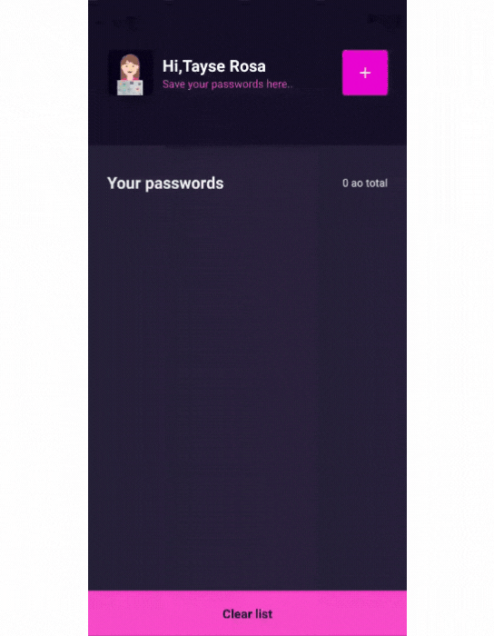

<h1 align="center"> React Native - App que salva senhas utilizando armazenamento local (Async Storage)</h1>

#Índice
- [Demo](#demo)
- [🛠 Sobre o projeto](#-sobre-o-projeto)
- [🚀 Tecnologias utilizadas neste projeto](#-tecnologias-utilizadas-neste-projeto)
- [📥 Como usar](#-como-usar)
- [🚀 Autor](#-autor)
  

# Demo
<p align="center">

</p>

---
# 🛠 Sobre o projeto

<p>Este projeto foi desenvolvido junto com a live de React Native na Rocketseat, o grande Rodrigo Gonçalves Santana, e fiz uma versão levemente melhorada, adicionando ao projeto original da live o seguinte:

* Uma validação de campos (apenas aceitar se todos os campos estiverem preenchidos)
* Adicionei também a funcionalidade de Deletar Todos os registros na tela Home
* Modifiquei as cores do layout para uma versão Dark.</p>


# 🚀 Tecnologias utilizadas neste projeto

- [x] REACT NATIVE
- [x] EXPO
- [x] ASYNC STORAGE
- [x] TYPESCRIPT
- [x] COMPONENTS
- [x] LIB TOAST(UTILIZADO PARA APRESENTAR AS MENSAGENS DE SUCESSO E ERRO NA TELA)

# 📥 Como usar
```js

    //Clonar o repositório
    $ git clone https://github.com/TayseRosa/save-passwords-async-storage.git

    //Entrar no diretório
    $ cd save-passwords-async-storage

    //Instalar bilbiotecas
    $ npm install

    //Startar o projeto
    $ expo start

``` 

# 🚀 Autor

<a href="https://www.tayserosa.dev">
 
 <br />
 <sub><b>www.tayserosa.dev</b></sub></a> <a href="https://www.tayserosa.dev" title="Tayse Rosa" target="_blank">🚀</a>


Feito com ❤️ por Tayse Rosa 🚀

👋🏽 Entre em contato!

[](https://github.com/TayseRosa/)
